# Assignment-4
In this assignment, an application with user login and showing movies was developed. The user signs up to the application with their email, password and username. In the application, the home page contains the latest movies. These movies can be filtered by genre. You can search for movies by name from the search page. Finally, it can edit application and account settings.

## Used technologies
- React Native CLI
- React Native Navigation
- Redux Toolkit
- React Native Vector Icons
- React Native AsyncStorage
- Axios
- Json Server

## Screens
<div>
<kbd>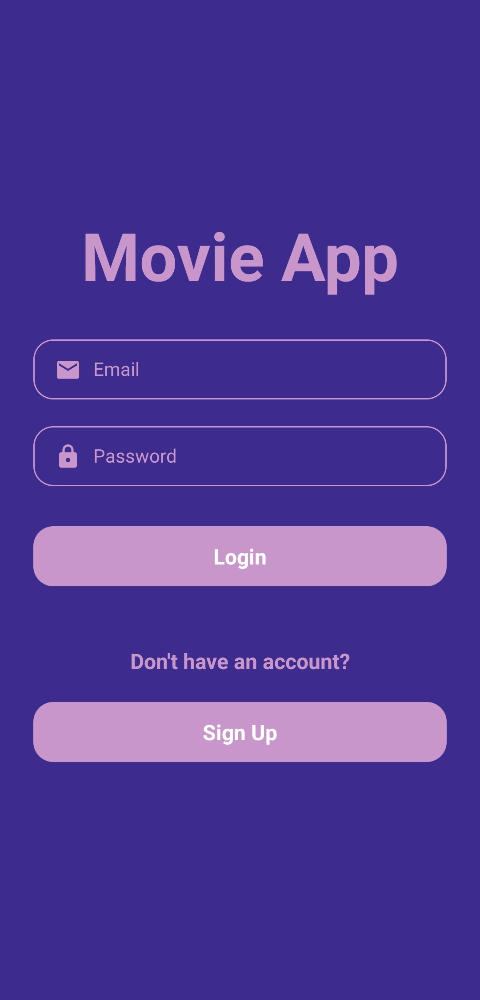</kbd>
<kbd>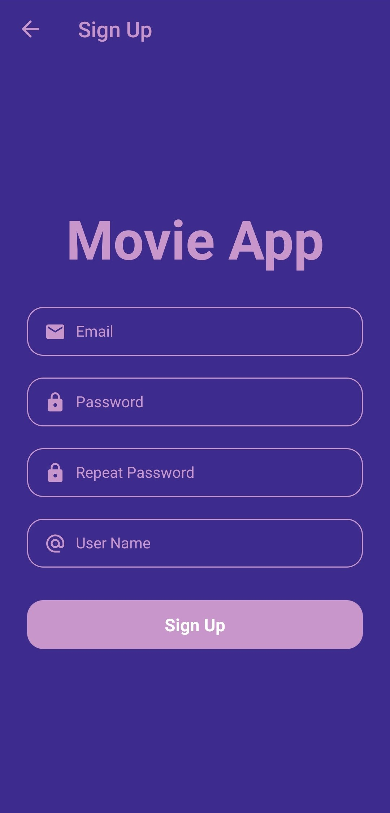</kbd>
</div>
<div>
<kbd>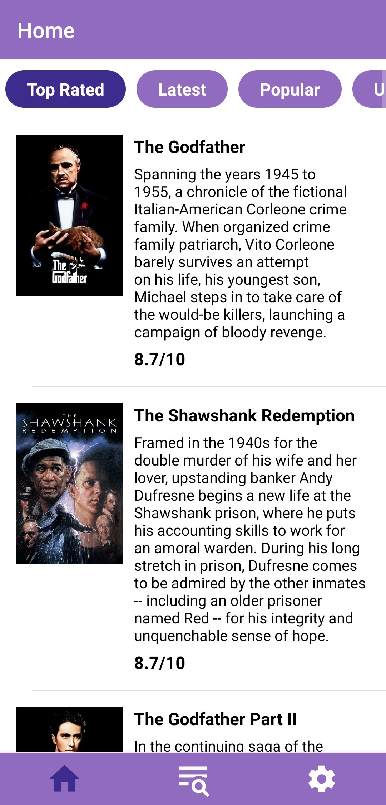</kbd>
<kbd>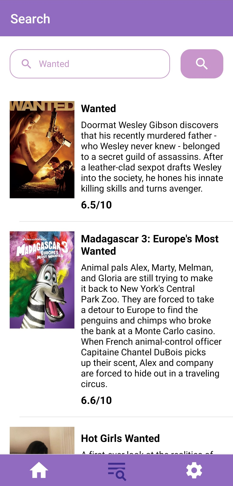</kbd>
<kbd>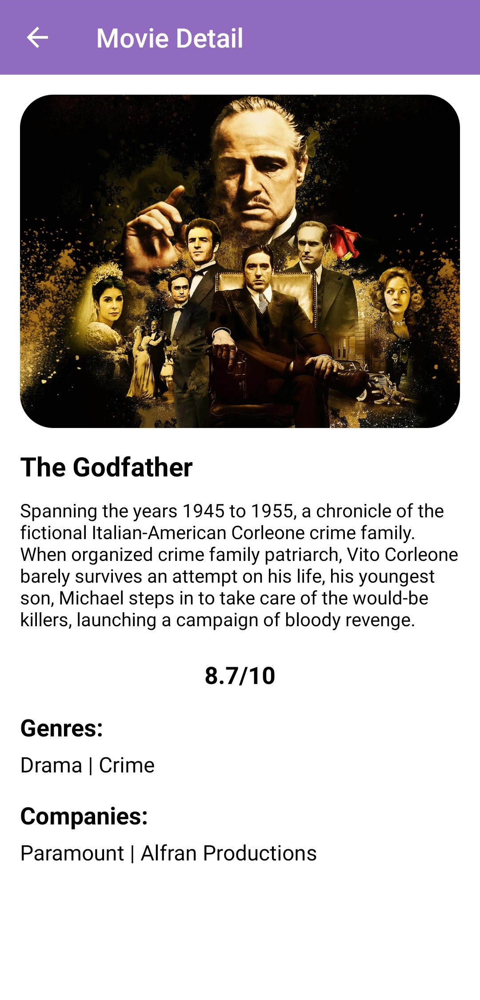</kbd>
</div>
<div>
<kbd>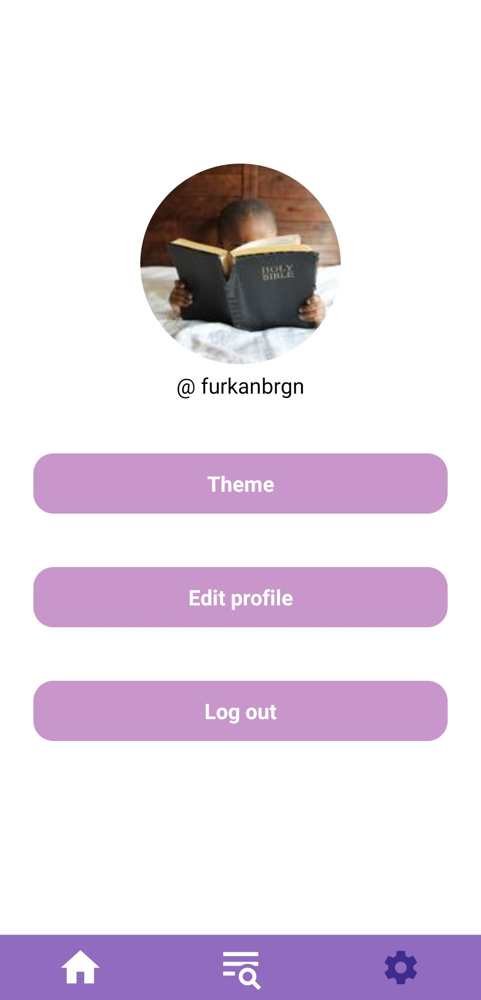</kbd>
<kbd>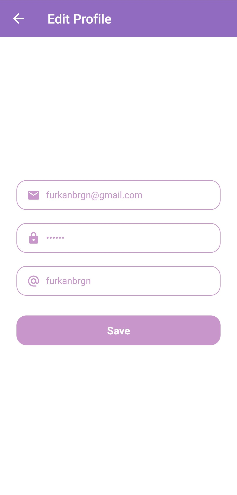</kbd>
<kbd>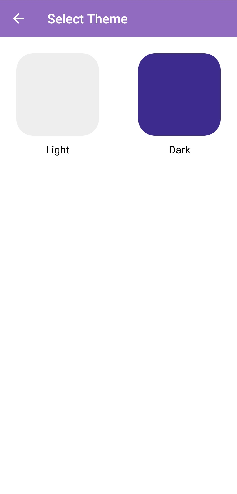</kbd>
</div>
<div>
<kbd>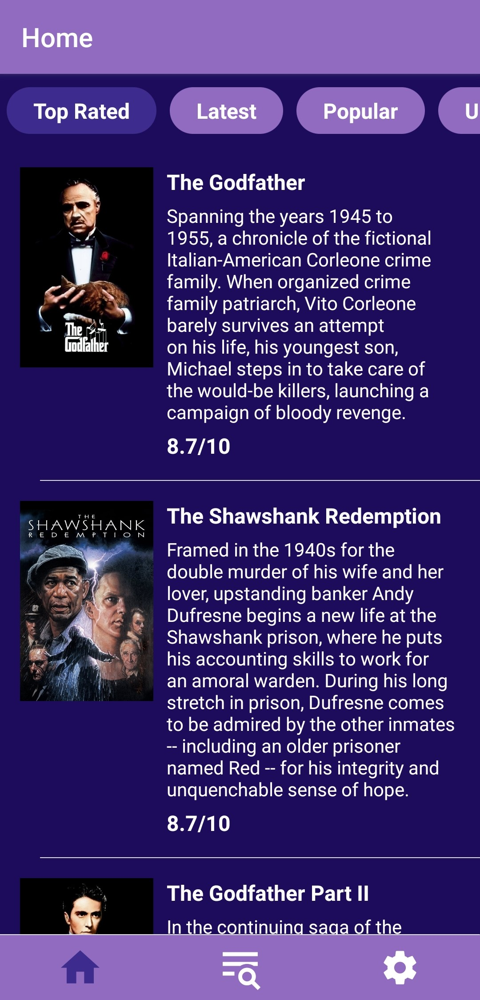</kbd>
<kbd>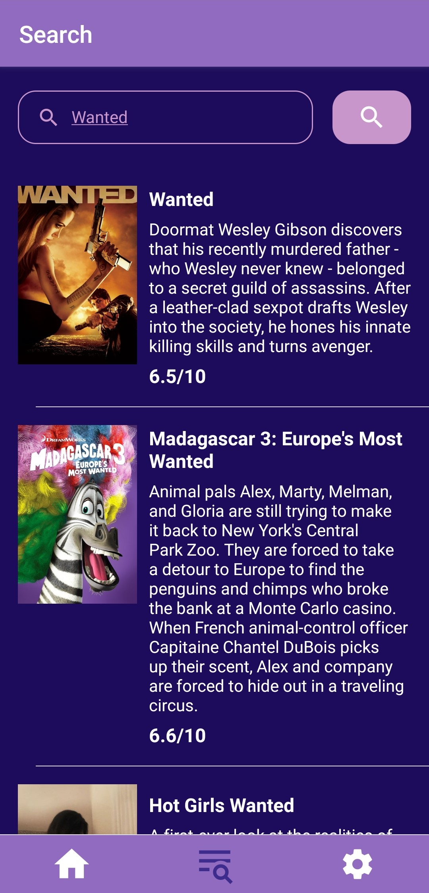</kbd>
<kbd>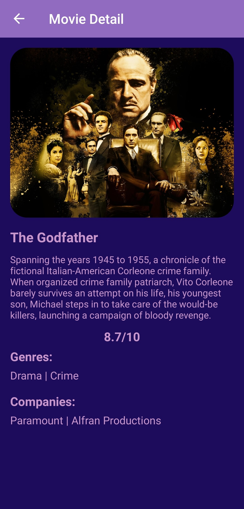</kbd>
</div>
<div>
<kbd>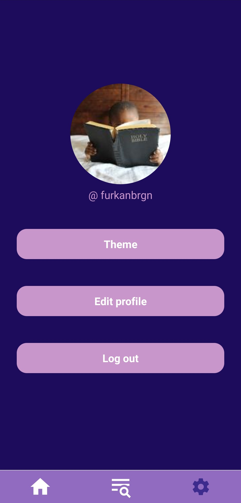</kbd>
<kbd>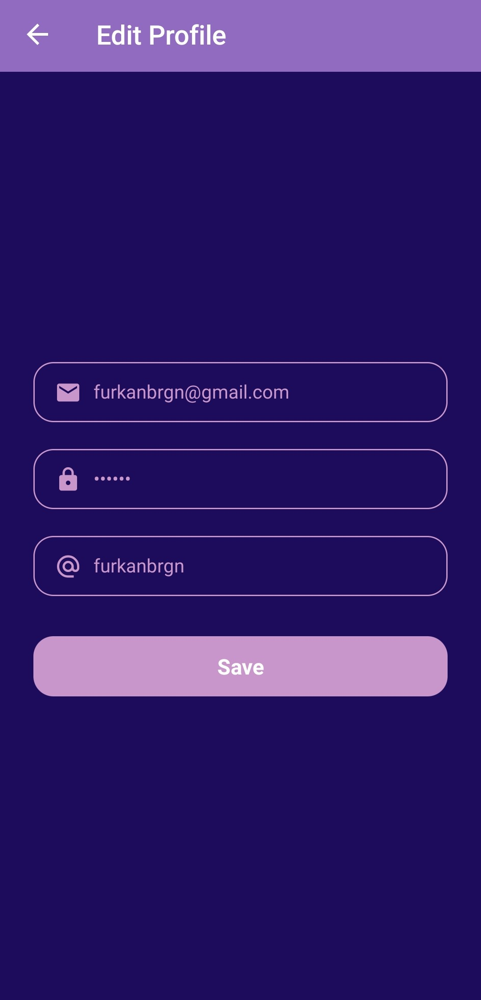</kbd>
<kbd>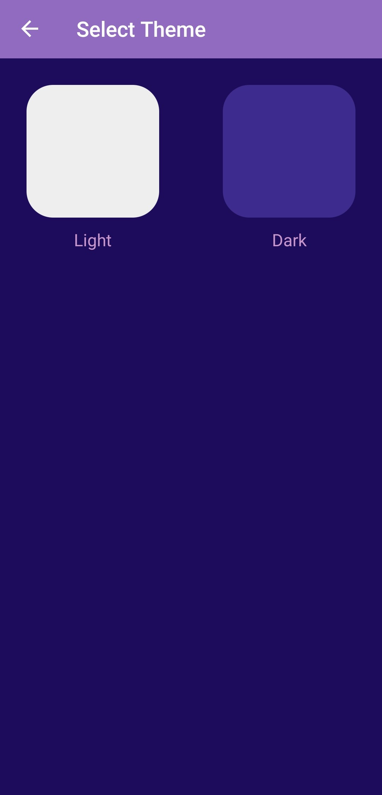</kbd>
</div>

## Installation
1.Clone Project
```
git clone https://github.com/patika-218-akbank-reactnative-bootcamp/assignment-4-furkanbagirgan.git
```
2.Install the Necessary Packages for Project
```
npm install
```
3.Run Project To Emulator or Real Device
```
npx react-native start & npx react-native run-android
```
